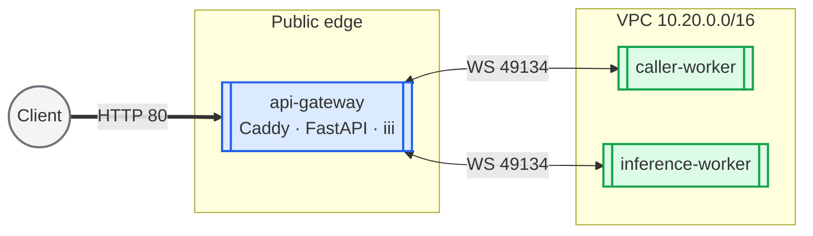
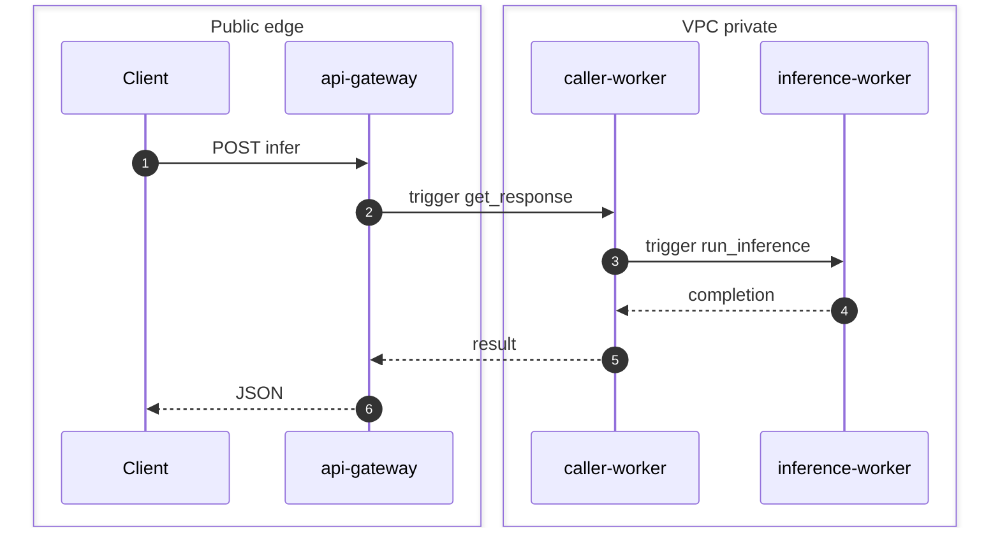

# Distributed Inferencing Prototype (DigitalOcean)

Reproducible **DigitalOcean** deployment: small language model behind a distributed `iii` worker mesh, exposed as a public HTTP JSON API.

| Worker | Language | Function | Role |
|--------|----------|----------|------|
| `inference-worker` | Python | `inference::run_inference` | Model inference (private VM) |
| `caller-worker` | TypeScript | `inference::get_response` | RPC fan-out (private VM) |
| `api-gateway` | Python (FastAPI) | — | Public `POST /infer` (public VM) |

**Stack:** Terraform · cloud-init · systemd · Cloud Firewalls · VPC

**Fork:** https://github.com/theanuragg/hiring.git

Personal deploy steps: **[plan.md](./plan.md)**

---

## Live deployment (`blr1`)

| Resource | Endpoint / IP |
|----------|----------------|
| Public API | http://64.227.180.170/infer |
| Health | http://64.227.180.170/healthz |
| api-gateway (public) | `64.227.180.170` |
| api-gateway (VPC) | `10.20.0.2` |
| caller-worker (VPC) | `10.20.0.3` |
| inference-worker (VPC) | `10.20.0.4` |
| VPC CIDR | `10.20.0.0/16` |

---

## Architecture

### Topology



Only **api-gateway** has a public IP. Workers use `public_networking = false`.

### Request flow



---

## Security

- Internet → gateway: `tcp/80`, `tcp/443`
- Admin IP → gateway: `tcp/22`
- Workers → gateway: `tcp/49134` (iii WebSocket)
- Gateway → workers: `tcp/22` (bastion SSH only)
- Workers: no public IP, no inbound from internet

---

## HTTP API

**`GET /healthz`**

```bash
curl -s http://64.227.180.170/healthz
```

**`POST /infer`**

```bash
curl -s http://64.227.180.170/infer \
  -H "Content-Type: application/json" \
  -d '{
    "prompt": "Hello from Alchemyst",
    "max_tokens": 64,
    "temperature": 0.7
  }'
```

Request fields: `prompt` (required), `max_tokens`, `temperature`, `system_prompt` (optional).

Response shape:

```json
{
  "completion": "...",
  "model": "quickstart-slm",
  "latency_ms": 123,
  "trace_id": "uuid"
}
```

---

## Redeploy from scratch

### Prerequisites

- DigitalOcean account + [API token](https://cloud.digitalocean.com/account/api/tokens)
- Terraform `>= 1.6` (`brew tap hashicorp/tap && brew install hashicorp/tap/terraform`)
- SSH key
- Fork with this `quickstart/` tree pushed to `main`

### Steps

```bash
cd may-2026/devops/quickstart
cp .deploy.env.example .deploy.env
# Edit: DIGITALOCEAN_TOKEN, GITHUB_USER=theanuragg

export DIGITALOCEAN_TOKEN="dop_v1_..."
./scripts/deploy.sh
```

Or manually:

```bash
cd infra
cp terraform.tfvars.example terraform.tfvars
# edit vars
export DIGITALOCEAN_TOKEN="dop_v1_..."
terraform init && terraform apply
```

Wait **10–20 minutes** for cloud-init + model download, then:

```bash
./scripts/test-api.sh
```

### Outputs

```bash
cd infra && terraform output
```

### Destroy

```bash
./scripts/destroy.sh
```

---

## Repository layout

```text
quickstart/
├── infra/           # Terraform
├── deploy/          # cloud-init, systemd, bootstrap
├── app/api-gateway/ # FastAPI
├── workers/         # caller + inference
├── scripts/         # deploy.sh, test-api.sh
├── README.md
└── plan.md
```

---

## Troubleshooting

| Issue | Fix |
|-------|-----|
| Connection refused on :80 | Push code to fork; SSH gateway and run `bootstrap-api-gateway.sh` |
| `/infer` 502 | Wait for inference worker; check `journalctl -u alchemyst-inference-worker` |
| SSH blocked | Update `admin_cidr_blocks` in `terraform.tfvars`, re-apply |

```bash
ssh root@$(cd infra && terraform output -raw api_public_ip)
journalctl -u iii-engine -u alchemyst-api -u caddy -f
```

---

## Production hardening

Before production I would add TLS termination (DO Load Balancer or Caddy with a real domain and ACME), API authentication and per-tenant rate limits, and move secrets off disk into a managed secret store. 

### Observability & Logging
For a production-grade mesh, I would implement a centralized observability stack:
- **Logging**: Deploy `Promtail` on each VM to ship systemd journal logs to a central **Loki** instance. This allows querying logs across the gateway, caller, and inference workers using a single Trace ID.
- **Metrics**: Export `iii-engine` and FastAPI metrics to **Prometheus**, visualized via **Grafana** dashboards.
- **Tracing**: Instrument the Python and TypeScript workers with **OpenTelemetry** to visualize request spans and identify RPC bottlenecks in the mesh.

Deployments would use health-checked rolling updates, infrastructure drift detection, and regular image patching.

SSH would be restricted further (no direct root, short-lived certs, or console-only access). Network policies would be reviewed quarterly, and egress from workers would be limited to required endpoints only.

---

## Scaling to a 100x larger model

A model 100x larger would not run on `s-2vcpu-4gb` CPU Droplets. I would move inference to GPU-class hosts (DO GPU Droplets or a dedicated serving platform), scale `inference-worker` horizontally behind an internal load balancer or queue, and keep the API gateway stateless. Request batching, KV-cache reuse, and optional response caching would reduce cost. For orchestration at scale, I would migrate to DOKS (Kubernetes) with HPA on inference pods, model artifacts in object storage, and separate node pools for API vs inference workloads.

---

## References

- https://iii.dev/docs/
- Assignment: `../devops-internship-assignment.md`
